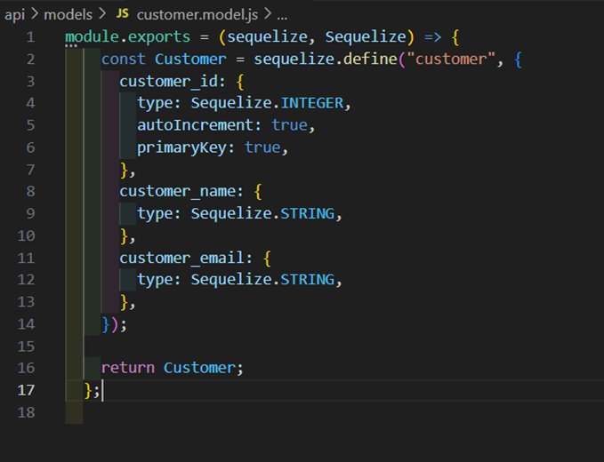
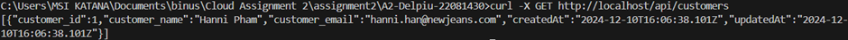

# README.md

IMPORTANT: Once you've cloned this to your forked repository, ensure that you continuously update this document as you complete each task to demonstrate your ongoing progress.

Please include your shared repository link here:

Delpiu's shared repository: https://github.com/delpiulopez/A2-Delpiu-22081430.git

### Task 6: Database Models and API Operations

#### Models

1. **customer.model.js**: defines the database schema for ‘customer’ table. It enables the app to interact with customer data efficiently using Sequelize without raw SQL queries.

_Screenshot:_

2. **item.model.js**: defines the structure for ‘item’ table in the database, allowing seamless interaction with item data through Sequelize ORM, avoiding manual SQL handling.

_Screenshot:_

3. **order.model.js**: defines structure for the ‘order’ table, establishing relationships with the customer and item tables through FKs, linking orders to customers and items in the database efficiently.

_Screenshot:_

#### API Operations

- **Items**
  - Create: `curl -X POST http://localhost/api/items -H "Content-Type: application/json" -d "{\"item_name\":\"Test Item\",\"item_price\":100}"`

_Screenshot:_

  - Retrieve: `curl -X GET http://localhost/api/items`

_Screenshot:_

  - Update: `curl -X PUT http://localhost/api/items/1 -H "Content-Type: application/json" -d "{\"item_name\":\"Labubu\",\"item_price\":777}"`

_Screenshot:_

  - Delete: `curl -X DELETE http://localhost/api/items/1`

_Screenshot:_

- **Customers**
  - Create: `curl -X POST http://localhost/api/customers -H "Content-Type: application/json" -d "{\"customer_name\":\"Hanni Pham\",\"customer_email\":\"hanni.han@newjeans.com\"}"`

_Screenshot:_

  - Retrieve: `curl -X GET http://localhost/api/customers`

_Screenshot:_

  - Update: `curl -X PUT "http://localhost/api/customers/1" -H "Content-Type: application/json" -d "{\"customer_name\":\"Delpiu Lopez\",\"customer_email\":\"del.lopez@example.com\"}"`

_Screenshot:_

  - Delete: `curl -X DELETE http://localhost/api/customers/1`

_Screenshot:_

- **Orders**
  - Create: `curl -X POST http://localhost/api/orders -H "Content-Type: application/json" -d "{\"order_date\":\"2024-11-01\",\"customer_id\":2,\"item_id\":2}"`

_Screenshot:_

  - Retrieve: `curl -X GET http://localhost/api/orders`

_Screenshot:_

  - Update: `curl -X PUT http://localhost/api/orders/2 -H "Content-Type: application/json" -d "{\"order_date\":\"2024-11-02\",\"customer_id\":2,\"item_id\":3}"`

_Screenshot:_

  - Delete: `curl -X DELETE http://localhost/api/orders/2`

_Screenshot:_

#### API Endpoints

_Screenshot:_

_Screenshot:_

_Screenshot:_

---

### Frontend Components

#### General Overview
The frontend is designed to provide an intuitive interface for managing items, customers, and orders in the application. It enables users to perform CRUD (Create, Read, Update, Delete) operations on each entity with a clear and user-friendly layout, seamlessly interacting with the backend APIs for data manipulation and retrieval.

#### Components
1. **ItemComponent.js**: manages the creation, editing, deletion, and listing of items in the application. It connects to the backend API to maintain an up-to-date item list and provides an interface for managing individual items.
2. **CustomerComponent.js**: allows users to add, delete, and view customer details. It integrates with the backend to fetch and display customer data, ensuring the customer list is dynamically updated.
3. **OrderComponent.js**: facilitates creating and managing orders by linking customers with items. It fetches orders, items, and customers from the backend and provides an interface to create new orders or delete existing ones.

---

### Final Output
_Screenshots of the final output for frontend and backend interactions._

1. Items and Customers Management Interface:
   

2. Orders Management Interface:
   

---
