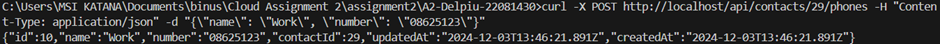

# README.md

IMPORTANT: Once you've cloned this to your forked repository, ensure that you continuously update this document as you complete each task to demonstrate your ongoing progress.

Please include your shared repository link here:

Delpiu's shared repository: https://github.com/delpiulopez/A2-Delpiu-22081430.git

## Tasks and Documentation

### Task 1: USER INTERFACE CHANGES

#### Change Button Label from Contact Component

_Screenshot:_


#### Change Button Label in Phone Component

_Screenshot:_


#### Change the Placeholder Text "Name" with Input Type Text into a Drop-down Menu with 4 Categories

_Screenshot:_


#### Change the Label "Name" to "Phone Type" 

_Screenshot:_


---

### Task 2: API OPERATIONS

#### Show Contact
```bash
curl -X GET http://localhost/api/contacts
```
_Screenshot:_


#### Add Contact
```bash
curl -X POST http://localhost/api/contacts -H "Content-Type: application/json" -d "{\"name\": \"Test Contact\", \"address\": \"123 Test St\"}"
```
_Screenshot:_


#### Delete Contact
```bash
curl -X DELETE http://localhost/api/contacts/1
```
_Screenshot:_


#### Update Contact
```bash
curl -X PUT http://localhost/api/contacts/1 -H "Content-Type: application/json" -d "{\"name\": \"Updated Contact\", \"address\": \"456 Updated Ave\"}"
```
_Screenshot:_


#### Show Phone
```bash
curl -X GET http://localhost/api/phones
```
_Screenshot:_


#### Add Phone
```bash
curl -X POST http://localhost/api/phones -H "Content-Type: application/json" -d "{\"number\": \"1234567890\", \"type\": \"mobile\", \"contact_id\": 1}"
```
_Screenshot:_


#### Delete Phone
```bash
curl -X DELETE http://localhost/api/phones/1
```
_Screenshot:_


#### Update Phone
```bash
curl -X PUT http://localhost/api/phones/1 -H "Content-Type: application/json" -d "{\"number\": \"0987654321\", \"type\": \"home\"}"
```
_Screenshot:_


---

### Task 3: DATABASE MODELLING WITH SEQUELIZE AND TEST THE API COMMANDS WHEN THE DATABASE MODIFICATION DONE

#### Table `contacts`
Added columns and updated constraints to better support relations.

_Screenshot:_


#### Table `phones`
Modified schema to include foreign key linking phones to contacts.

_Screenshot:_


#### Frontend Output
_Screenshot:_


#### Test the 8 APIs After Modifications

1. **Show Contact:**
   ```bash
   curl -X GET http://localhost/api/contacts
   ```
   _Screenshot:_
   

2. **Add Contact:**
   ```bash
   curl -X POST http://localhost/api/contacts -H "Content-Type: application/json" -d "{\"name\": \"Test Contact\", \"address\": \"123 Test St\"}"
   ```
   _Screenshot:_
   

3. **Update Contact:**
   ```bash
   curl -X PUT http://localhost/api/contacts/1 -H "Content-Type: application/json" -d "{\"name\": \"Updated Contact\", \"address\": \"456 Updated Ave\"}"
   ```
   _Screenshot:_
   

4. **Delete Contact:**
   ```bash
   curl -X DELETE http://localhost/api/contacts/1
   ```
   _Screenshot:_
   

5. **Show Phone:**
   ```bash
   curl -X GET http://localhost/api/phones
   ```
   _Screenshot:_
   

6. **Add Phone:**
   ```bash
   curl -X POST http://localhost/api/phones -H "Content-Type: application/json" -d "{\"number\": \"1234567890\", \"type\": \"mobile\", \"contact_id\": 1}"
   ```
   _Screenshot:_
   

7. **Update Phone:**
   ```bash
   curl -X PUT http://localhost/api/phones/1 -H "Content-Type: application/json" -d "{\"number\": \"0987654321\", \"type\": \"home\"}"
   ```
   _Screenshot:_
   

8. **Delete Phone:**
   ```bash
   curl -X DELETE http://localhost/api/phones/1
   ```
   _Screenshot:_
   

---

### Task 4: EXPANDING THE EXISTING TABLES (E.G. COMPANY)

#### Companies table

_Screenshot:_


#### Add Company
```bash
curl -X POST http://localhost/api/companies -H "Content-Type: application/json" -d "{\"company_name\": \"Ador\", \"company_address\": \"Incheon 2\", \"contact_id\": 37}"
```
_Screenshot:_


#### Show Company
```bash
curl http://localhost/api/companies/37
```
_Screenshot:_


#### Update Company
```bash
curl -X PUT http://localhost/api/companies/1/contacts/37 -H "Content-Type: application/json" -d "{\"company_name\": \"Nwjns Inc\", \"company_address\": \"Tamsur\"}"
```
_Screenshot:_


#### Delete Company
```bash
curl -X DELETE http://localhost/api/companies/1/contacts/37
```
_Screenshot:_


---

### Task 5: FRONTEND

#### Overview of New Files
I created 3 new files – “NewCompany.js, Company.js, and CompanyList.js”. Each of the files has their own purposes, but collectively, the addition of the 3 new files provide a complete CRUD interface to manage companies tied to a specific contact.

1. **NewCompany.js**: defines the NewCompany component which provides a form for users to input a new company name and company address and sends a request to create a new company associated with a contact.

_Screenshot:_


2. **CompanyList.js**: defines the CompanyList component that manages the list of companies associated with a contact. It displays companies in a table form integrating the Company component for each row and includes the NewCompany components to add new company entries.

_Screenshot:_


3. **Company.js**: defines the Company component, representing a single company in a table row. It has functionality to let users delete or edit the company entries they have made previously.

_Screenshot:_


#### Integration
The new components were integrated into `Contact.js` to support CRUD operations for companies. A `useEffect` hook fetches company data dynamically and updates the `companies` state.

_Screenshot:_


#### Frontend Output
_Screenshot:_


---
